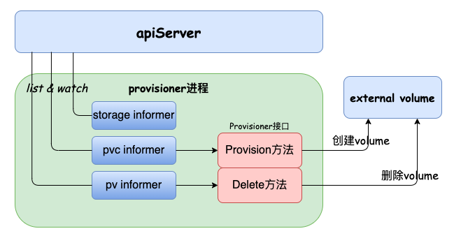

# static provisioning

在kubernetes pod应用中如果有持久化数据的场景，一般会接触到pvc、pv和storageClass这些概念：

- **pvc**: `描述的是pod希望使用的持久化存储的属性`
- **pv**: `描述的是具体的持久化存储数据卷信息`
- **storageClass**: `创建pv的模板`

如果在实际中我们要用到nfs作为pod应用的持久化存储，一般会如下几个步骤：

1. `nfs server端创建一个目录`
2. `创建pv，并配置nfs server和挂载路径`
3. `创建pvc，并与上述pv绑定`
4. `pod引用上述pvc`

暂且抛开第4步，前面3步我们可以通过手动（或者通过程序）一步一步地执行，这种方式在kubernetes中叫作`static provisioning`。相比这种人工管理pv的方式，kubernetes也提供了一套自动创建pv的的机制，叫作`dynamic provisioning`。

# dynamic provisioning

所谓的dynamic provisioning，从功能上来讲就是用户基于某个storageClass创建pvc后，会有一个provisioner负责`自动创建卷`、`自动创建pv`并`自动和pvc绑定`。

kubernetes已经支持了一些[内置的provisioner](https://kubernetes.io/docs/concepts/storage/storage-classes/#provisioner)，例如AzureDisk、RBD等。如果遇到一些不在kubernetes内置prvisioner范围内的存储（例如nfs）且有自动创建pv需求的场景，就需要我们自己实现一个provisioner。

实现一个provisioner其实很简单，只需要实现如下的`Provisioner`接口即可，其它工作社区维护的库中已经有了相关逻辑：
```go
// sigs.k8s.io/sig-storage-lib-external-provisioner/v8/controller
type Provisioner interface {
    Provision(context.Context, ProvisionOptions) (*v1.PersistentVolume, ProvisioningState, error)
    Delete(context.Context, *v1.PersistentVolume) error
}
```

# nfs-provisioner

provisioner接口有两个方法：`Provision`和`Delete`，这两个方法要实现的逻辑也很简单。我们以nfs为例，尝试实现一个provisioner：

>完整示例代码在github：[https://github.com/nuczzz/nfs-provisioner](https://github.com/nuczzz/nfs-provisioner)

- **`Provision`**

Provision方法里实现两个逻辑：`创建卷（volume）`和`返回一个pv对象`，对于nfs来说，创建卷的时候创建一个目录用于挂载即可，目录名可以用pv名称。于是有如下代码:
```go
import (
    "github.com/pkg/errors"
    v1 "k8s.io/api/core/v1"
    metav1 "k8s.io/apimachinery/pkg/apis/meta/v1"
    "sigs.k8s.io/sig-storage-lib-external-provisioner/v8/controller"
)

func (nfs *nfsProvisioner) Provision(_ context.Context, opt controller.ProvisionOptions) (*v1.PersistentVolume, controller.ProvisioningState, error) {
    // 创建卷
    mountPath := filepath.Join(nfs.mountPath, opt.PVName)
    if err := os.Mkdir(mountPath, 0755); err != nil {
        log.Printf("mkdir %s error: %s", mountPath, err.Error())
        return nil, controller.ProvisioningFinished, errors.Wrap(err, "mkdir error")
    }

    // 返回pv对象
    return &v1.PersistentVolume{
        ObjectMeta: metav1.ObjectMeta{
            Name: opt.PVName,
        },
        Spec: v1.PersistentVolumeSpec{
            PersistentVolumeReclaimPolicy: *opt.StorageClass.ReclaimPolicy,
            AccessModes:                   opt.PVC.Spec.AccessModes,
            MountOptions:                  opt.StorageClass.MountOptions,
            Capacity: v1.ResourceList{
                v1.ResourceStorage: opt.PVC.Spec.Resources.Requests[v1.ResourceStorage],
            },
            PersistentVolumeSource: v1.PersistentVolumeSource{
                NFS: &v1.NFSVolumeSource{
                    Server:   nfs.server,
                    Path:     filepath.Join(nfs.rootMountPath, opt.PVName),
                    ReadOnly: false,
                },
            },
        },
    }, controller.ProvisioningFinished, nil
}
```

- **`Delete`**

Delete方法则只需要移除对应的nfs目录即可：
```go
func (nfs *nfsProvisioner) Delete(_ context.Context, pv *v1.PersistentVolume) error {
    return os.Remove(filepath.Join(nfs.mountPath, pv.Name))
}
```

##### 部署验证

相应的部署yaml如下，包含storageClass、rbac和一个deployment的定义（注意最后deployment yaml中需要配置好实际的nfs服务IP和路径）：
```yaml
apiVersion: storage.k8s.io/v1
kind: StorageClass
metadata:
  name: nfs
provisioner: nfs # 需要和程序中的provisioner名称对应

---
apiVersion: rbac.authorization.k8s.io/v1
kind: ClusterRole
metadata:
  name: nfs-provisioner
rules:
  - apiGroups:
      - ""
    resources:
      - "persistentvolumes"
    verbs:
      - "get"
      - "list"
      - "watch"
      - "create"
      - "delete"
  - apiGroups:
      - ""
    resources:
      - "persistentvolumeclaims"
    verbs:
      - "get"
      - "list"
      - "watch"
      - "update"
  - apiGroups:
      - "storage.k8s.io"
    resources:
      - "storageclasses"
    verbs:
      - "get"
      - "list"
      - "watch"
  - apiGroups:
      - ""
    resources:
      - "events"
    verbs:
      - "get"
      - "list"
      - "watch"
      - "create"
      - "update"
      - "patch"
  - apiGroups:
      - "coordination.k8s.io"
    resources:
      - "leases"
    verbs:
      - "get"
      - "list"
      - "watch"
      - "create"
      - "update"
      - "patch"

---
apiVersion: rbac.authorization.k8s.io/v1
kind: ClusterRoleBinding
metadata:
  name: nfs-provisioner
subjects:
  - kind: ServiceAccount
    name: nfs-provisioner
    namespace: kube-system
roleRef:
  kind: ClusterRole
  name: nfs-provisioner
  apiGroup: rbac.authorization.k8s.io

---
apiVersion: v1
kind: ServiceAccount
metadata:
  name: nfs-provisioner
  namespace: kube-system

---
apiVersion: apps/v1
kind: Deployment
metadata:
  namespace: kube-system
  name: nfs-provisioner
spec:
  replicas: 1
  selector:
    matchLabels:
      app: nfs-provisioner
  template:
    metadata:
      labels:
        app: nfs-provisioner
    spec:
      serviceAccountName: nfs-provisioner
      containers:
        - name: nfs-provisioner
          image: nfs-provisioner:v0.1
          imagePullPolicy: IfNotPresent
          args:
            - --server= # 配置nfs server ip
            - --serverPath= # 配置nfs server root path
          volumeMounts:
            - name: nfs
              mountPath: /mount
      volumes:
        - name: nfs
          nfs:
            server: "" # 配置nfs server ip
            path: "" # 配置nfs server root path
```

我们创建一个pvc来测试下功能：
```yaml
apiVersion: v1
kind: PersistentVolumeClaim
metadata:
  name: test-pvc
spec:
  accessModes:
    - ReadWriteOnce
  storageClassName: nfs
  resources:
    requests:
      storage: 1Gi
```

apply这个pvc文件，观察是否会`自动创建卷`、`自动创建pv并绑定`：
```shell
# kubectl get pv
No resources found.
# kubectl get pvc
No resources found.
# kubectl apply -f pvc.yaml 
persistentvolumeclaim/test-pvc created
# kubectl get pvc
NAME       STATUS   VOLUME                                     CAPACITY   ACCESS MODES   STORAGECLASS   AGE
test-pvc   Bound    pvc-48f40158-027a-482f-899d-7b1aa9b5090f   1Gi        RWO            nfs            15s
# kubectl get pv
NAME                                       CAPACITY   ACCESS MODES   RECLAIM POLICY   STATUS   CLAIM              STORAGECLASS   REASON   AGE
pvc-48f40158-027a-482f-899d-7b1aa9b5090f   1Gi        RWO            Delete           Bound    default/test-pvc   nfs                     20s

// 查看nfs server目录下是否创建对应的卷
# ls
pvc-48f40158-027a-482f-899d-7b1aa9b5090f
```
再验证删除功能，观察删除pvc后，对应的pv和卷是否会自动删除：
```shell
# kubectl delete -f pvc.yaml 
persistentvolumeclaim "test-pvc" deleted
# kubectl get pvc
No resources found.
# kubectl get pv
No resources found.

// 检查卷是否被删除
# ls
#
```

# dynamic provisioning的原理

通过前面nfs provisioner示例大家应该能比较清晰地理解dynamic provisioning的作用：`基于pvc自动创建卷和pv并绑定`。但是为什么我们实现了前文的`Provisioner`接口的`Provision`和`Delete`方法，就可以实现dynamic provisioning？

我们基于`sigs.k8s.io/sig-storage-lib-external-provisioner/v8@v8.0.0`来分析下原理，在`sigs.k8s.io/sig-storage-lib-external-provisioner/v8@v8.0.0`中会启动三种资源的informer：

- **`storageClass informer`**

缓存storageClass资源，一方面用于校验用户创建pvc中的storageClass是否匹配，另一方面因为storageClass可以看做pv的模板，有些参数需要从storageClass对象中拿到并填充到pv对象中。

- **`pvc informer`**:

缓存pvc对象并注册pvc对象的事件处理函数，当收到pvc事件后会先判断是否需要provision，例如必须是没有绑定pv的pvc才能通过判断。通过判断后会调用Provisoner接口的`Provision`方法，也就是走到了我们自己实现的逻辑里去创建卷并初始化pv对象。之后基于`Provision`方法返回的pv对象`填充pv.spec.ClaimRef字段（与pvc绑定）`、`增加一个finalizer`等，最后调apiServer接口`创建pv`。

- **`pv informer`**:

缓存pv对象并注册pv对象的事件处理函数，当收到pv事件后会先判断是否需要删除，判断条件包括`pv对象的DeletionTimestamp不为空`且`provisioner的finalizer还存在`等。如果通过判断，会调用我们实现的`Delete`方法中，也就是去清除对应的物理资源。清理完物理资源后移除pv对象中`provisioner的finalizer`并更新pv对象。

于是有如下逻辑：



# dynamic provisoning的不足

我们知道了dynamic provisioning可以自动创建卷和pv并绑定，但是它的功能也仅仅如此。对于一些复杂的存储，例如谷歌的Persistent Disk，需要`“创建磁盘”`、`挂载到宿主机`、`格式化`、`mount到pod目录`等操作后才能正常使用，很显然这种场景下单纯的provisioning过程是满足不了需求的。面对这些复杂场景，kubernetes抽象出了CSI（Container Storage Interface）来处理，敬请期待接下来CSI相关的文章。
